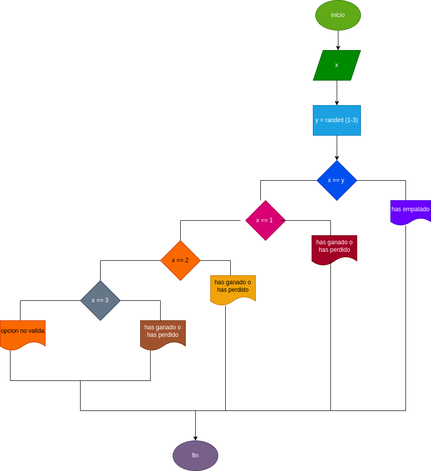

# piedra_papel_tijera
jugar piedra papel o tijera contra la maquina

# ANALISI

entrada de variables 
x = jugador 1 
y = maquina (1 = "piedra" 2 = "papel= 3 = "tijera")

entrada de proceso y salida 
X = 1 "has ganado o has perdido"
x = 2 "has ganado o has perdido"
x = 3 "has ganado o has perdido"
opcion no valida 

# DISEÑO

# CONSTRUCCION 
